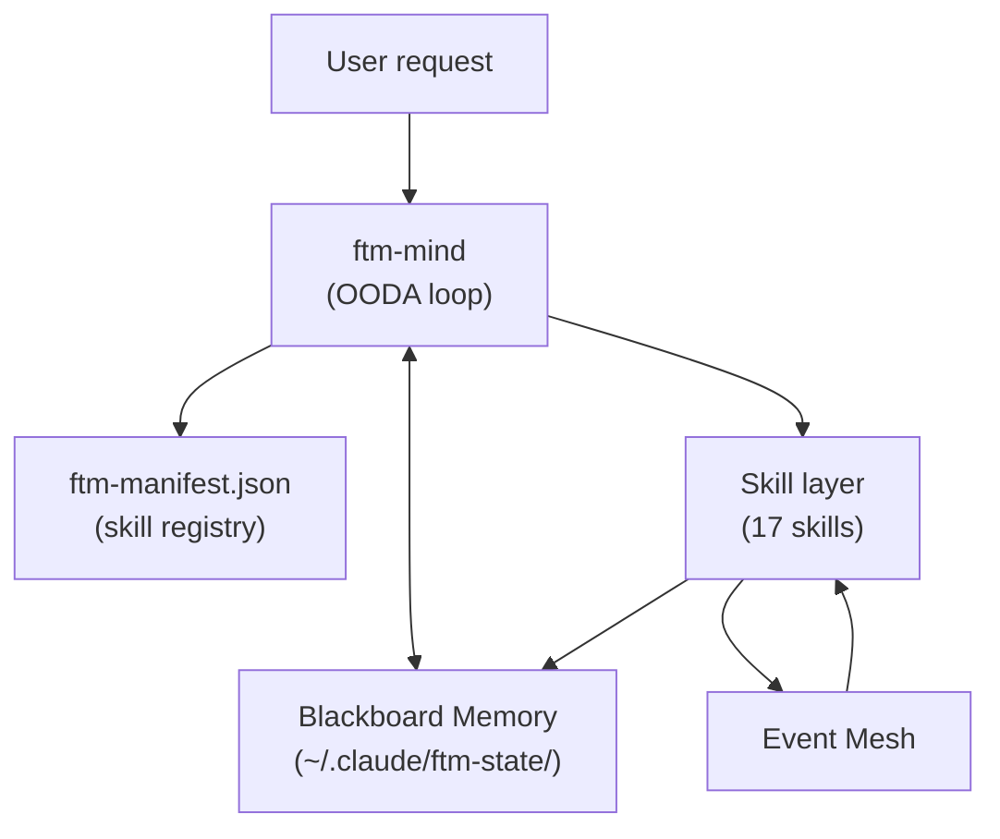
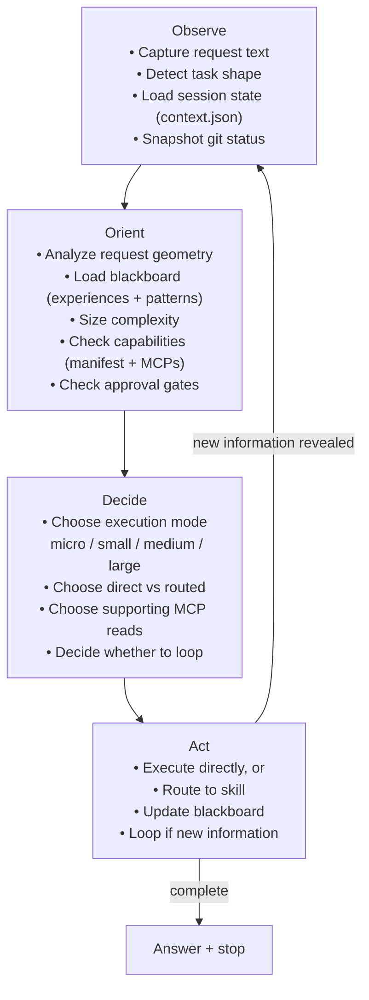
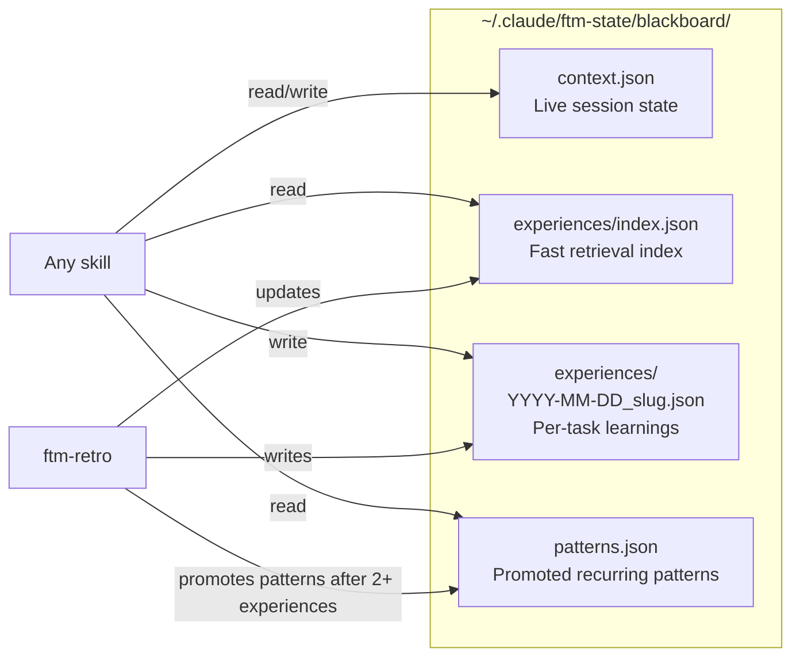
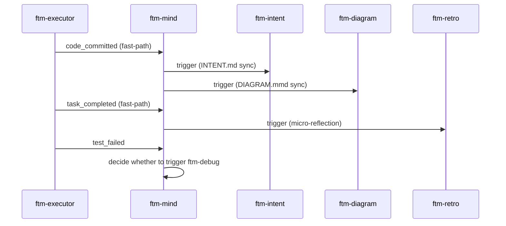
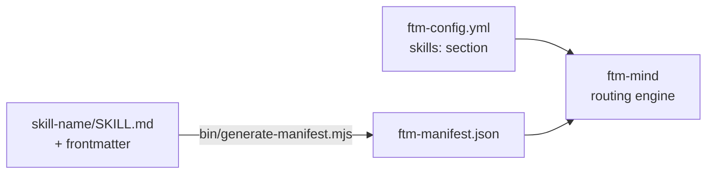
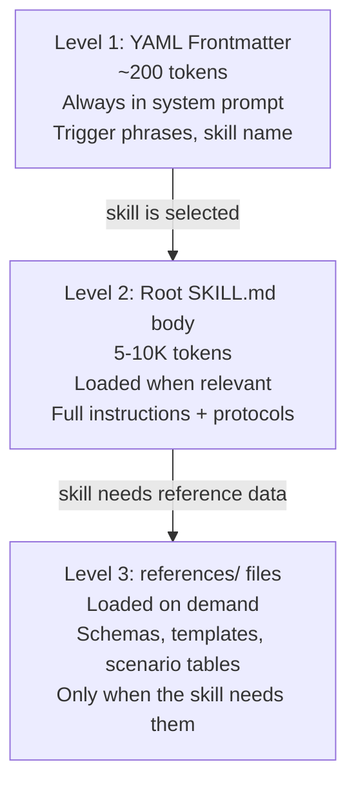

# FTM Architecture

FTM is a skill orchestration layer for Claude Code. It adds persistent memory, intelligent routing, and multi-model deliberation on top of Claude Code's base capabilities. Every request is interpreted, sized, and dispatched through a unified cognitive loop before any work is done.

---

## Table of Contents

- [System Overview](#system-overview)
- [OODA Loop](#ooda-loop)
- [Blackboard Memory](#blackboard-memory)
- [Event Mesh](#event-mesh)
- [Skill Manifest](#skill-manifest)
- [Progressive Disclosure](#progressive-disclosure)
- [Approval Flow](#approval-flow)
- [Configuration](#configuration)

---

## System Overview

The entry point is always `ftm-mind`. It loads memory, consults the manifest, sizes the task, and either acts directly or delegates to a skill. Skills communicate with each other through the event mesh and share state through the blackboard.

---

## OODA Loop

FTM-mind runs an Observe-Orient-Decide-Act loop on every request. Most requests finish in one pass. Complex requests loop several times.

### Execution Modes

| Mode | When | What happens |
|------|------|-------------|
| `micro` | Single obvious edit, trivial blast radius | Direct action, no plan |
| `small` | 1-3 files, one concern, clear done state | Direct action + verification |
| `medium` | Multi-file, ordering matters, moderate uncertainty | Short plan, then execute |
| `large` | Cross-domain, major uncertainty, existing plan doc | Route to `ftm-brainstorm` (plan) or `ftm-executor` (execute) |

The ADaPT rule governs escalation: try the simpler tier first. Escalate only when the simple approach fails, the user explicitly asks for more, or the complexity is obvious from the start.

### Orient Priority Order

When signals conflict, Orient trusts them in this order:

1. User intent and explicit instructions
2. Live codebase and tool state
3. Session trajectory and recent decisions
4. Relevant past experiences
5. Promoted patterns
6. Default heuristics

Experience and patterns are accelerators, not authorities. They never override direct evidence from the present task.

---

## Blackboard Memory

The blackboard is a file-based shared memory system. All skills read from and write to it using the standard file tools — no APIs, no libraries.

### Files and Responsibilities

| File | Owns | Never contains |
|------|------|----------------|
| `context.json` | Active session state — current task, recent decisions, constraints, preferences | Cross-session learnings |
| `experiences/YYYY-MM-DD_slug.json` | One task's outcome, lessons, capabilities used | Current session state |
| `experiences/index.json` | Lightweight index for fast retrieval (no full content) | Full experience content |
| `patterns.json` | Promoted meta-insights confirmed across 2+ sessions | Raw individual experiences |

### Memory Lifecycle

1. **During a task**: `context.json` is updated after each meaningful action.
2. **After task completion**: `ftm-retro` writes an experience file and updates the index.
3. **Pattern promotion**: After 2+ experience files confirm the same insight, `ftm-retro` promotes it to `patterns.json`. Confidence tracks from `low` (2 occurrences) → `medium` (4+) → `high` (8+).
4. **Pruning**: The index caps at 200 entries. Automatic pruning removes oldest low-confidence entries first.

### Concurrency Rules

During parallel `ftm-executor` waves, only the orchestrator writes `index.json`. Individual executor agents write their own experience files (filenames are unique by slug). After wave completion, the orchestrator merges all new entries into the index in a single write.

### Schemas

JSON schemas for all four blackboard files live at `ftm-state/schemas/`. They are enforced by the schema validation step in CI.

---

## Event Mesh

Skills communicate through a typed event system. After completing an action, a skill emits one or more events. Other skills that declare they listen for that event are triggered by `ftm-mind`.

### Fast-Path vs Mediated Events

| Type | Behavior |
|------|----------|
| **Fast-path** | Bypass mind mediation. Always trigger listeners immediately. Used when the downstream response is unconditional. |
| **Mediated** | Pass through mind's Decide phase. Mind evaluates context before triggering listeners. |

**Fast-path events**: `code_committed` (triggers intent + diagram sync) and `task_completed` (triggers retro micro-reflection).

All other events are mediated.

### Event Registry

The full event vocabulary — descriptions, emitters, listeners, payloads — is defined in `ftm-mind/references/event-registry.md`. The event validator (`bin/validate-events.mjs`) checks that every event declared in a `SKILL.md` file exists in the registry and that every registry event is referenced by at least one skill.

### Key Events

| Event | Emitted by | Triggers |
|-------|-----------|---------|
| `code_committed` | executor | intent sync, diagram sync, codex-gate |
| `task_completed` | all skills | retro micro-reflection |
| `test_failed` | executor, debug | ftm-debug auto-investigation |
| `bug_fixed` | debug | retro experience recording |
| `audit_complete` | audit | executor result interpretation |
| `secrets_found` | git | executor commit/push block |
| `experience_recorded` | retro | mind pattern evaluation |

---

## Skill Manifest

`ftm-manifest.json` is the machine-readable registry of all skills. It is the single source of truth `ftm-mind` uses for routing decisions.

### Manifest Contents

Each skill entry includes:

- `name` — skill identifier
- `description` — what the skill does and when to use it (used for routing decisions)
- `trigger_file` — the `.yml` file to invoke the skill
- `events_emits` / `events_listens` — event mesh connections
- `blackboard_reads` / `blackboard_writes` — memory access patterns
- `references` — reference files the skill loads on demand
- `enabled` — routing eligibility flag
- `size_bytes` — SKILL.md size for monitoring

### CI Validation

CI validates manifest freshness by re-running `bin/generate-manifest.mjs` and diffing the output against the committed file. A stale manifest fails the build.

---

## Progressive Disclosure

Skills use a three-level architecture to minimize token usage. The system loads only what is needed at each stage.

### Token Impact

| Scenario | Tokens loaded |
|----------|--------------|
| Request that doesn't match any skill | ~200 × 17 skills = ~3,400 |
| Request routed to one skill | ~3,200 base + 5-10K for that skill's body |
| Skill needs a reference file | + 1-5K per reference loaded |

This architecture delivers approximately 96% token savings for interactions that don't require full skill activation.

### Reference Files

Each skill may have a `references/` directory containing:
- Protocol documents (approval flows, complexity guides)
- Scenario tables for routing decisions
- Templates the skill fills in during execution
- Schema references

Reference files are internal. They are not part of the public API surface.

---

## Approval Flow

The approval mode is set in `ftm-config.yml` under `execution.approval_mode`. It controls whether the user sees and approves a plan before execution begins.

| Mode | Behavior |
|------|---------|
| `auto` | No approval gate. Micro/small execute directly. Medium shows steps then runs. Large routes to brainstorm or executor. |
| `plan_first` | For medium and large tasks, present a numbered plan and wait for approval before executing anything. |
| `always_ask` | Same as `plan_first` but also applies to small tasks. Only micro tasks skip the gate. |

### External Actions Always Require Approval

Regardless of `approval_mode`, these action types always require explicit approval before execution:

- Slack messages, emails
- Jira / Confluence / Freshservice mutations
- Calendar changes
- Browser form submissions
- Git pushes to remote
- Deployments

Auto-proceed (no approval needed): local code edits, documentation, tests, local git operations, reading from any MCP, blackboard reads/writes.

---

## Configuration

Configuration is covered in detail in [CONFIGURATION.md](CONFIGURATION.md).

Key configuration points:

- **Profiles** (`quality` / `balanced` / `budget` / `custom` / `inherit`) control which model is used at each stage — planning, execution, and review.
- **Execution settings** control parallelism, auto-audit, progress tracking, and the approval mode.
- **Skills section** enables or disables individual skills for routing. A disabled skill is invisible to ftm-mind.
- **Session settings** control auto-pause behavior and how long state files are retained.

The active configuration file is `~/.claude/ftm-config.yml`. The default values ship as `ftm-config.default.yml` in the repository.
