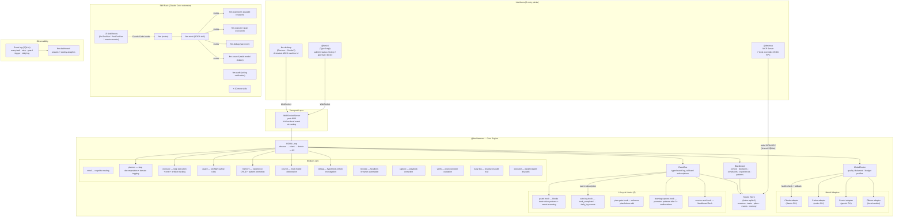

# Feed The Machine — System Architecture

```mermaid
graph TB
    subgraph Interfaces["Interfaces (3 entry points)"]
        CLI["@ftm/cli<br/>(TypeScript)<br/>submit / status / history / approve / doctor"]
        ELECTRON["ftm-desktop<br/>(Electron + Svelte 5)<br/>Animated ASCII machine UI"]
        MCP["@ftm/mcp<br/>MCP Server<br/>7 tools over stdio JSON-RPC"]
    end

    subgraph Transport["Transport Layer"]
        WS["WebSocket Server<br/>port 4040<br/>bi-directional event streaming"]
    end

    subgraph Daemon["@ftm/daemon — Core Engine"]
        OODA["OODA Loop<br/>observe → orient → decide → act"]
        ROUTER["ModelRouter<br/>quality / balanced / budget profiles"]
        BB["Blackboard<br/>context · decisions · constraints · experiences · patterns"]
        EB["EventBus<br/>typed event log, wildcard subscriptions"]
        STORE["SQLite Store<br/>(better-sqlite3)<br/>sessions · tasks · plans · events · memory"]

        subgraph Modules["Modules (12)"]
            MIND["mind — cognitive routing"]
            PLANNER["planner — step decomposition + domain tagging"]
            EXECUTOR["executor — step execution + retry + artifact tracking"]
            GUARD["guard — pre-flight safety rules"]
            MEMORY["memory — experience CRUD + pattern promotion"]
            COUNCIL["council — multi-model deliberation"]
            DEBUG["debug — hypothesis-driven investigation"]
            BROWSE["browse — headless browser automation"]
            CAPTURE["capture — playbook extraction"]
            VERIFY["verify — post-execution validation"]
            DAILY["daily-log — structured audit trail"]
            EXEC2["executor — parallel agent dispatch"]
        end

        subgraph Adapters["Model Adapters"]
            CLAUDE["Claude adapter<br/>(claude CLI)"]
            CODEX["Codex adapter<br/>(codex CLI)"]
            GEMINI["Gemini adapter<br/>(gemini CLI)"]
            OLLAMA["Ollama adapter<br/>(local models)"]
        end

        subgraph Hooks["Lifecycle Hooks (6)"]
            GUARD_H["guard-hook — blocks destructive patterns + secret scanning"]
            LOG_H["auto-log-hook — task_completed → daily_log events"]
            PLAN_H["plan-gate-hook — enforces plan-before-edit"]
            LEARN_H["learning-capture-hook — promotes patterns after 3+ confirmations"]
            SESSION_H["session-end-hook — blackboard flush"]
        end
    end

    subgraph SkillPack["Skill Pack (Claude Code extension)"]
        FTM_ROUTER["ftm (router)"]
        FTM_MIND["ftm-mind (OODA skill)"]
        FTM_BRAIN["ftm-brainstorm (parallel research)"]
        FTM_EXEC["ftm-executor (plan execution)"]
        FTM_DEBUG["ftm-debug (war room)"]
        FTM_COUNCIL["ftm-council (multi-model debate)"]
        FTM_AUDIT["ftm-audit (wiring verification)"]
        MORE["+ 20 more skills"]
        SHELL_HOOKS["15 shell hooks<br/>(PreToolUse / PostToolUse / session events)"]
    end

    subgraph Observability["Observability"]
        EVENTS["Event log (SQLite)<br/>every task · step · guard trigger · daily log"]
        DASHBOARD["ftm-dashboard<br/>session + weekly analytics"]
    end

    CLI -->|WebSocket| WS
    ELECTRON -->|WebSocket| WS
    MCP -->|"stdio JSON-RPC<br/>(shared SQLite)"| STORE

    WS --> OODA
    OODA --> ROUTER
    OODA --> BB
    OODA --> EB
    BB --> STORE
    EB --> STORE

    ROUTER -->|health check + fallback| CLAUDE
    ROUTER --> CODEX
    ROUTER --> GEMINI
    ROUTER --> OLLAMA

    OODA --> GUARD
    OODA --> PLANNER
    OODA --> EXECUTOR
    OODA --> COUNCIL
    OODA --> MEMORY
    OODA --> DEBUG

    EB -->|event subscription| LOG_H
    EB --> GUARD_H
    EB --> LEARN_H
    EB --> SESSION_H

    SHELL_HOOKS -.->|Claude Code hooks| FTM_ROUTER
    FTM_ROUTER --> FTM_MIND
    FTM_MIND -->|routes| FTM_BRAIN
    FTM_MIND -->|routes| FTM_EXEC
    FTM_MIND -->|routes| FTM_DEBUG
    FTM_MIND -->|routes| FTM_COUNCIL

    EVENTS --> DASHBOARD
```

**368 tests · 18 suites · published to npm as `feed-the-machine`**
