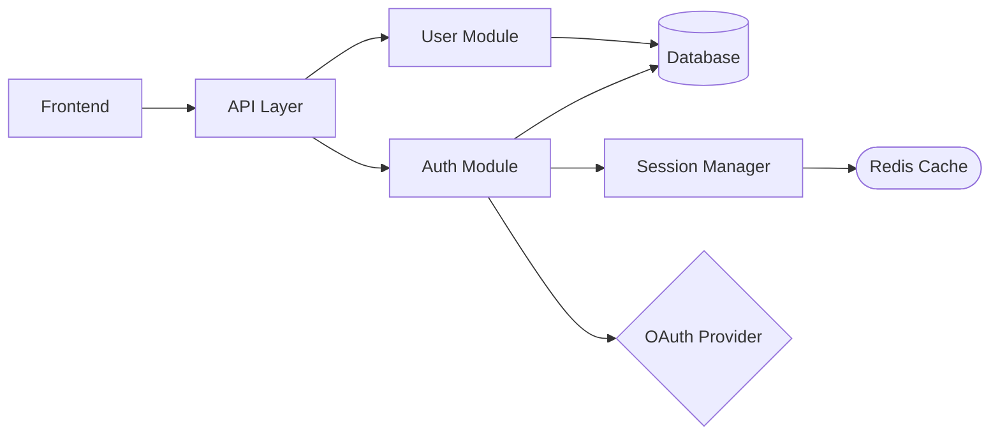
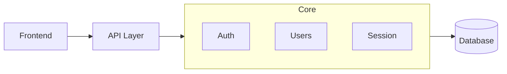
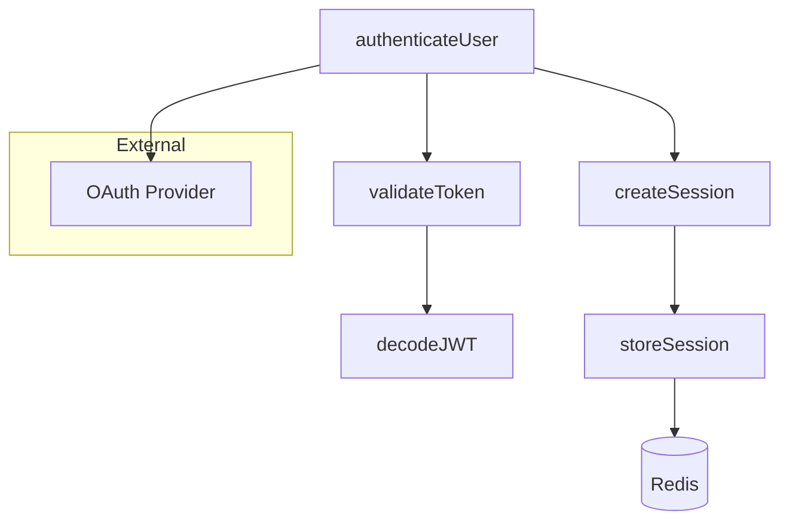
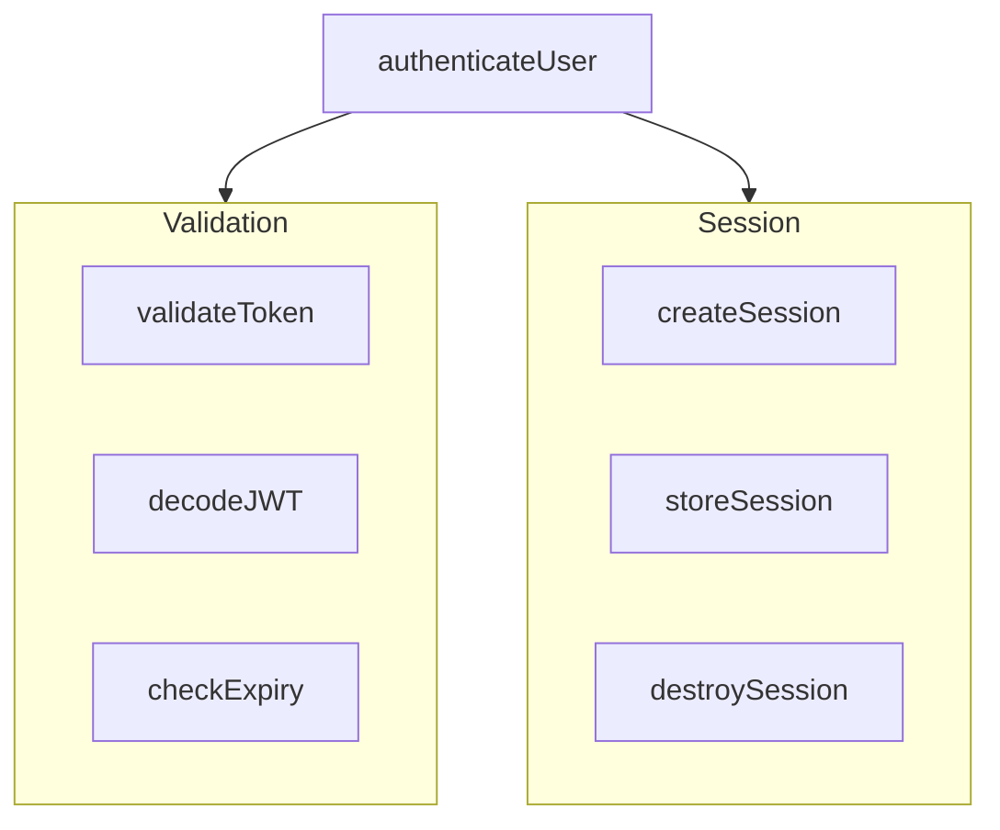

## Events

### Emits
- `documentation_updated` — when one or more .mmd diagram files are written or modified to reflect new or changed modules and functions
- `task_completed` — when the full diagram sync pass completes (bootstrap or incremental)

### Listens To
- `code_committed` — fast-path: automatically update DIAGRAM.mmd nodes and edges for every changed module after each commit

# Architecture Diagram Manager

Two-level diagram system: a root subway map of modules and per-module street maps of functions. Both use `.mmd` files (renderable in GitHub and VSCode).

---

## Graph-Powered Mode (ftm-map integration)

Before running the standard analysis, check if the project has a code knowledge graph:

```bash
if [ -f ".ftm-map/map.db" ]; then
    # Use graph for faster, more consistent diagram generation
    ftm-map/scripts/.venv/bin/python3 ftm-map/scripts/views.py generate-diagrams "$PROJECT_ROOT"
else
    # Fall back to standard analysis below
fi
```

When `.ftm-map/map.db` exists:
1. Delegate to `views.py generate-diagrams` which reads the graph and produces .mmd files
2. Diagrams from the graph are structurally accurate (real edges from parsing, not heuristic guesses)
3. Supports `--files` flag for incremental updates

When `.ftm-map/map.db` does NOT exist:
- Fall back to the existing modes below
- No breaking change — behavior is identical without the graph

## Mental Model

| Level | File | Layout | Node = | Purpose |
|-------|------|---------|--------|---------|
| Root | `ARCHITECTURE.mmd` | `graph LR` | Module/directory | High-altitude subway map |
| Module | `src/auth/DIAGRAM.mmd` | `graph TD` | Function | Ground-level street map |

**Rule of thumb**: If you're asking "what talks to what?", look at `ARCHITECTURE.mmd`. If you're asking "how does this module work internally?", look at the module's `DIAGRAM.mmd`.

---

## Root ARCHITECTURE.mmd

### What it shows
Module-to-module dependencies. An edge `A --> B` means A imports from / depends on B.

### Node shape conventions
- `[ModuleName]` — standard module or directory
- `[(Database)]` — data store (Postgres, Redis, SQLite, etc.)
- `{ExternalService}` — third-party API or external dependency
- `([Cache])` — caching layer

### Example


### Scaling rule
Max ~15 nodes. If more modules exist, group related ones into subgraphs:


---

## Per-Module DIAGRAM.mmd

Place at `<module-path>/DIAGRAM.mmd` (e.g., `src/auth/DIAGRAM.mmd`).

### What it shows
Function-to-function call graph within the module, plus external dependencies the module touches.

### Layout: `graph TD` (top-down)

### Example


### Subgraph conventions
- `subgraph External` — third-party services the module calls
- `subgraph DB` — database tables the module reads/writes
- `subgraph Shared` — shared utilities imported from elsewhere

### Scaling rule
Max ~20 function nodes. If more, group by responsibility:


---

## Mermaid Syntax Standards

- File extension: `.mmd` (not `.md`)
- Node IDs: `camelCase` (used in edges)
- Node labels: human-readable in `[brackets]` — e.g., `auth[Authentication]`
- Edge direction: `-->` for dependencies, `-. optional .->` for optional/conditional
- No quotes around node IDs unless they contain special characters
- Renderable as-is in GitHub and VSCode Mermaid Preview

---

## Bootstrap: New Project

When no diagrams exist yet:

1. **Scan for modules** — list top-level directories and key files under `src/` (or equivalent)
2. **Find import relationships** — for each module, grep for `import ... from` statements pointing to other modules
3. **Generate root ARCHITECTURE.mmd** — one node per module, edges from import graph
4. **Generate per-module DIAGRAM.mmd** — for each module, list exported functions and their internal call relationships

Scan strategy (in order of reliability):
- Read `package.json` / `tsconfig.json` to understand project structure
- List directories under `src/` or main source root
- For each directory, read index files to find public exports
- Grep for cross-module imports to draw edges

---

## Incremental Updates

When diagrams already exist, do not regenerate from scratch. Read the current diagram, identify what changed, apply the delta.

| Event | Action |
|-------|--------|
| New module created | Add node to `ARCHITECTURE.mmd` + create `module/DIAGRAM.mmd` |
| New function created | Add node to module's `DIAGRAM.mmd` with correct edges |
| Function renamed | Update node ID and label in `DIAGRAM.mmd` |
| Dependency added | Add edge in relevant diagram(s) |
| Dependency removed | Remove edge in relevant diagram(s) |
| Module deleted | Remove node and all its edges from `ARCHITECTURE.mmd`, delete `DIAGRAM.mmd` |
| Function deleted | Remove node and edges from `DIAGRAM.mmd` |

---

## Simplicity Rules

Diagrams that are too complex are useless. Apply these filters before writing:

1. **Omit pure utility functions** — `formatDate`, `clamp`, `sleep` don't need nodes unless they're called by many things
2. **Collapse leaf nodes** — if a function just wraps a DB call, show the DB node, not an intermediate wrapper
3. **Don't show every import** — only show edges where the dependency is architecturally meaningful
4. **Prefer clarity over completeness** — a diagram that shows the 80% important relationships is more useful than one that shows everything

---

## Output Format

When creating or updating diagrams, write the `.mmd` file content directly using the Write/Edit tools. Then confirm what was written:

```
Created: src/ARCHITECTURE.mmd  (6 modules, 8 edges)
Created: src/auth/DIAGRAM.mmd  (5 functions, Redis + OAuth dependencies)
Updated: src/users/DIAGRAM.mmd  (added createUser node)
```

---

## Usage Examples

**Bootstrap a new project:**
> "ftm-diagram — bootstrap diagrams for this project"
Scan the codebase, generate root + per-module diagrams.

**After adding a new module:**
> "update diagram — I just added src/notifications/"
Add `Notifications` node to ARCHITECTURE.mmd, create `src/notifications/DIAGRAM.mmd`.

**After adding a function:**
> "update diagram — added sendEmail to src/notifications/"
Add `sendEmail` node with edges to `src/notifications/DIAGRAM.mmd`.

**View current architecture:**
> "show architecture"
Read and display `ARCHITECTURE.mmd` + list available module diagrams.

---

### Auto-Invocation by ftm-executor

This skill's format is used by ftm-executor's documentation pipeline. After every commit during plan execution, agents update INTENT.md (or DIAGRAM.mmd) entries following this skill's templates. The updates are automatic and don't require explicit skill invocation — agents reference the format directly.
